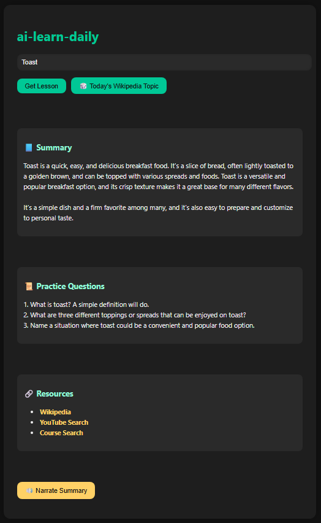

# 🎓 AI Learning Feed

An AI-powered web app that delivers custom mini-lessons on any topic — from computer science to cheese 🧀.

Powered by Cohere’s large language models, this app generates:
- ✅ A clear summary of the topic
- ✅ 3 practice questions
- ✅ 3 learning resources (Wikipedia, YouTube, Course)
- ✅ Optional narration with built-in text-to-speech
- ✅ “Surprise me” mode powered by Wikipedia’s Featured Article of the Day

---

## 🌐 Live Demo

Try it here: [https://ai-learning-feed.onrender.com/](https://ai-learning-feed.onrender.com/)

---

## 📸 Preview

---

## 🚀 Features

| Feature                         | Description                                                               |
|--------------------------------|---------------------------------------------------------------------------|
| 🧠 AI Summary Generator         | Generates a beginner-friendly explanation of any topic                   |
| 🎲 Wikipedia Surprise Mode      | Uses the featured article from Wikipedia’s homepage as a daily lesson    |
| 🔗 Real Learning Resources      | Curates Wikipedia, YouTube, and course links                             |
| 🔊 Narrator                    | Uses browser speech synthesis to read the summary aloud                  |
| 💡 Simple Frontend             | Clean UI built with HTML + CSS                                            |
| 🔒 API Key protected backend   | Flask backend using Cohere API securely via `.env`                        |

---

## 🛠️ Tech Stack

- **Frontend:** HTML, CSS, Vanilla JS
- **Backend:** Python, Flask
- **AI Model:** [Cohere API](https://cohere.com)
- **Voice:** Browser's built-in Text-to-Speech (`SpeechSynthesis`)
- **Wikipedia API:** For daily featured topics

---

## 📦 Setup & Usage

### 1. Clone this repository

git clone https://github.com/yoavbh10/ai-learning-feed.git
cd ai-learning-feed

### 2. Create and activate a virtual environment (optional but recommended)

python -m venv venv
venv\Scripts\activate        # On Windows

### 3. Install dependencies

pip install -r requirements.txt

### 4. Set your Cohere API Key

Create a .env file in the root directory:
COHERE_API_KEY=your_cohere_api_key_here

### 5. Run the app

python app.py
Visit http://127.0.0.1:5000 in your browser.

## 📁 Project Structure

ai-learning-feed/
├── app.py

├── .env

├── .gitignore

├── README.md

├── templates/

│   └── index.html

├── static/

│   └── style.css

└── venv/

## ✨ Future Improvements

Add support for GPT or OpenRouter as fallback
Deploy to Render / Netlify / Replit
Save past lessons to local storage
Add feedback rating system

## 📜 License

MIT — feel free to use, share, or modify this project.

## 👋 Author

Made with ❤️ by Yoavbh10
